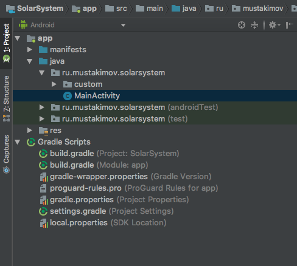
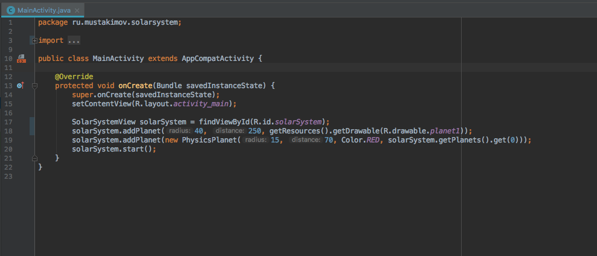

# Инструкция по прохождению хакатона
Хм, ты все-таки решил продолжить... Хорошо, тогда начнем наш мастер-класс.

## Подготовка для тех, кто решил повторить дома
Для начала скачай себе на компьютер этот проект при помощи [git](https://git-scm.com/)

    git clone https://github.com/Mikhail57/SolarSystem.git

Скачай, если у тебя еще не стоит, [Android Studio](https://developer.android.com/studio/)

Все сделал? Ну тогда продолжаем!
## Для всех
1. Запусти Android Studio. Подожди, пока она откроется (на линуксе она работает быстрее, но это так, на заметку).
2. Открой в Android Studio этот проект.
3. В левой панеле раскрой папку `app`, в ней папку `java`, в ней папку с длинным именем `ru.mustakimov.solarsystem`, и, наконец, в этой папке кликни дважды на файл `MainActivity`

4. Так, теперь перед нами открылся страшный и ужасный КОД.

